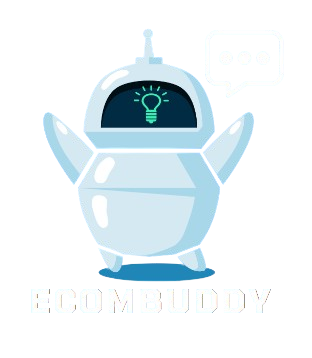

<!--  -->

    <h1><b>ECOMBUDDY</b></h1>
    
      
    
Your friendly shopping companion, EcomBuddy is designed to enhance your online shopping experience. With personalized recommendations, real-time support, and insights tailored just for you, this chatbot helps you discover products you'll love while fostering loyalty and preventing churn. Whether you need assistance or just want to chat about the latest trends, EcomBuddy is here to make your shopping journey enjoyable and effortless.

     

---

## 👨🏻‍👩🏻‍👦🏻‍👦🏻 **Team Members**
- Sulthan Fachry  
Data Scientist & Data Analyst 
    [GitHub](https://github.com/sulthanfi) | [LinkedIn](https://www.linkedin.com/in/wilson-773134243/)

- Abimanyu Maheswara 
Data Analyst 
    [GitHub](https://github.com/abimanyukayana) | [LinkedIn](https://www.linkedin.com/in/tasyamla/)

- Ciputra Wangsa  
Data Scientist 
    [GitHub](https://github.com/ciputrawangsa) | [LinkedIn](https://www.linkedin.com/in/devinirfana/)

- Khalil Zulfar  
Data Engineer 
    [GitHub](https://github.com/khalilzufar) | [LinkedIn](https://www.linkedin.com/in/frederick-kurniawan-putra-389b6a146/)

--- 
## 💾 **Dataset**
Our data contains information about UK e-commerce purchase from 2011.
[Source.](https://www.kaggle.com/datasets/carrie1/ecommerce-data/data)

---
## 📝 **Problem Background**

Dalam industri e-commerce yang kompetitif, mempertahankan loyalitas pelanggan menjadi tantangan utama. Pelanggan seringkali merasa kurang mendapatkan perhatian dan respons cepat saat menghadapi masalah, memiliki pertanyaan tentang produk, atau memerlukan bantuan selama proses pembelian. Ketidakpuasan ini dapat mengurangi pengalaman pelanggan, menurunkan tingkat retensi, dan mengakibatkan hilangnya peluang untuk menciptakan hubungan jangka panjang yang lebih kuat dengan pelanggan.

Untuk mengatasi tantangan ini, diperlukan solusi yang dapat memberikan pelayanan cepat, personal, dan responsif bagi pelanggan. Chatbot voice dan vision berbasis AI dapat menjadi solusi strategis untuk meningkatkan loyalitas pelanggan dengan memberikan pengalaman yang lebih baik, dukungan 24/7, dan interaksi yang relevan sesuai kebutuhan pelanggan.

---
## 🎯 **Objective**

Mengembangkan chatbot berbasis AI untuk meningkatkan loyalitas pelanggan pada platform e-commerce dengan cara menyediakan dukungan pelanggan yang responsif, personal, dan efektif 24/7, serta menciptakan pengalaman pengguna yang lebih interaktif, menyenangkan, dan memuaskan.
---
## 🚀 **Deployment & Dashboard**
We deployed our analysis result and predictor model on the web.
[Deploymnets](https://huggingface.co/spaces/dnirfana/Complaint_Ease?logs=build) | [Dashboard](https://bit.ly/Complaint-Ease-Dashboard)
